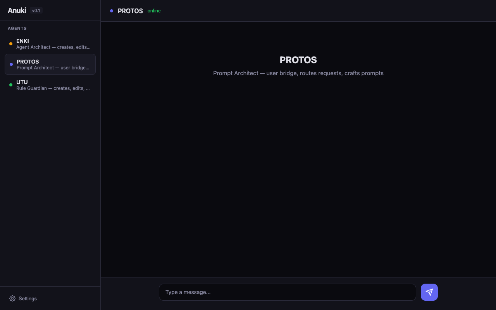

# Anuki

[](https://github.com/cylonmolting-creator/anuki/actions/workflows/ci.yml)

**Open-source AI Agent LEGO Platform** — Build, manage, and orchestrate your own multi-agent team.

Anuki gives you the building blocks. You build the team. Three core agents ship out of the box — use them to create unlimited specialized agents, enforce governance rules, and build a team that learns and remembers.



---

## Why Anuki?

> **Niche**: The only multi-agent framework that combines **production infrastructure** with **response-level verification**. We borrowed patterns from microservices (circuit breakers), message queues (pending completions), and operations engineering (health watchdog, graceful shutdown) — and applied them to AI agents. Your agents self-heal and survive restarts. And when an agent says "this function is unused", a Stop hook runs `grep` to check — if the claim is false, the response gets blocked. No other framework verifies what agents *claim*, not just what they *do*.

Most multi-agent frameworks require you to define agents in code. Anuki takes a different approach: **agents create agents**. You describe what you need in natural language, and the system builds it — complete with identity, personality, tools, safety rules, and memory.

**What makes it different:**

| Feature | Anuki | CrewAI | LangGraph | AutoGen | Dify |
|---------|-------|--------|-----------|---------|------|
| Create agents via natural language | Yes (ENKI) | No | No | No | Partial |
| Persistent agent identity (soul files) | 7+ file types | No | No | No | No |
| Cognitive memory (3 layers) | Yes | Partial | No | No | No |
| Response-level claim verification | **Yes** | No | No | No | No |
| Mechanical rule enforcement (SSOT) | Yes | No | No | No | No |
| Crash recovery (pending completions) | **Yes** | No | Partial | No | No |
| Circuit breaker per agent | **Yes** | No | No | No | No |
| Health watchdog + orphan cleanup | **Yes** | No | No | No | No |
| Inter-agent messaging + loop detection | **Yes** | Partial | Partial | Partial | No |
| Multi-LLM provider support | Yes | Yes | Yes | Yes | Yes |
| Zero-dependency frontend | Yes | No | No | No | No |

> Most AI agent frameworks focus on the AI part — prompting, memory, tool use. Anuki also brings **production infrastructure** to the agent world: patterns borrowed from microservices (circuit breakers), message queues (pending completions), and operations engineering (health watchdog, orphan cleanup, graceful shutdown). These aren't AI innovations — they're battle-tested engineering patterns applied to agents for the first time.

### Built for people who are new to AI agents

AI agent platforms have a dirty secret: they break in ways that only engineers can fix. Agent stuck in a loop? Kill the process. System crashed? Lost your data. Agent hallucinated? Hope you noticed.

Anuki eliminates these failure modes at the system level — so you don't have to know they exist:

| What goes wrong | What other frameworks do | What Anuki does |
|----------------|------------------------|-----------------|
| Agent gets stuck in a loop | Nothing — you debug it | Loop detection kills it automatically |
| Agent claims something false | Nothing — you trust it | Stop hook verifies the claim before you see it |
| System crashes mid-conversation | Data lost | Atomic writes protect state, pending completions deliver your response |
| An agent keeps failing | Errors pile up | Circuit breaker disables it, tests periodically, auto-recovers |
| Process becomes a zombie | You open terminal and kill it | Health watchdog cleans it up every 60 seconds |
| You disconnect mid-stream | Output lost | Resume buffer replays what you missed |

**You don't need to understand any of this.** `npm install`, `npm start`, open browser. The system handles the rest. Every mistake you could make as a beginner — the platform already prevents it.

---

## The 3 Core Agents

| Agent | Role | How It Works |
|-------|------|-------------|
| **PROTOS** | Default Agent & Prompt Architect | The first agent you talk to. Handles general requests and helps you craft optimal prompts for specialized agents. Routing to ENKI/UTU happens automatically at the system level via auto-router. |
| **ENKI** | Agent Creator | Tell ENKI what you need in plain language. It creates complete agents with soul files, memory, safety rules — everything. New agents appear in your sidebar immediately. |
| **UTU** | Rule Guardian | The designated authority on governance. UTU creates and modifies rules in `rules/`. Rules propagate automatically to all affected agents via the SSOT system. |

**Auto-routing**: You don't need to manually switch agents. If you tell PROTOS "create a research agent", the system detects the intent and routes to ENKI automatically.

---

## Quick Start

**Prerequisites**: [Node.js](https://nodejs.org) 18+ and one of the following LLM backends:

| Provider | What you need | Best for |
|----------|--------------|----------|
| **[Claude Code CLI](https://docs.anthropic.com/en/docs/claude-cli)** (recommended) | `npm install -g @anthropic-ai/claude-code` + Anthropic API key | Full agentic mode — tool use, file editing, session resume |
| **[OpenAI API](https://platform.openai.com)** | OpenAI API key | Agentic mode with tool use (GPT-4o / GPT-4o-mini) |
| **[Ollama](https://ollama.ai)** | Ollama installed locally | Free local models with tool use (Llama 3.1+, Mistral, Qwen, etc.) |

```bash
git clone https://github.com/cylonmolting-creator/anuki.git
cd anuki
cp .env.example .env    # Configure your LLM provider
npm install
npm start
```

Open `http://localhost:3000` in your browser. Start chatting with PROTOS — try "create a code review agent" or ask anything.

### Configuration

**`.env`** — Choose your LLM provider:

```env
# Pick one provider (default: claude)
LLM_PROVIDER=claude

# Claude (recommended — full agentic mode)
# CLAUDE_PATH=claude
# ANTHROPIC_API_KEY=sk-ant-...

# OpenAI (agentic mode with tool use)
# OPENAI_API_KEY=sk-...
# OPENAI_MODEL=gpt-4o

# Ollama (free local models)
# OLLAMA_URL=http://localhost:11434
# OLLAMA_MODEL=llama3.1
```

### Provider Setup (pick one)

<details>
<summary><strong>Claude Code CLI</strong> (recommended — full agentic mode)</summary>

1. Install Claude Code CLI: `npm install -g @anthropic-ai/claude-code`
2. Get an API key from [Anthropic Console](https://console.anthropic.com/)
3. Run `claude` once to authenticate (it opens a browser)
4. Edit `.env`:
   ```env
   LLM_PROVIDER=claude
   ```
5. Start Anuki: `npm start`

All providers support tool use, but Claude adds session resume across restarts and native file editing via Claude Code CLI. If unsure, start here.
</details>

<details>
<summary><strong>OpenAI API</strong> (agentic mode with GPT-4o)</summary>

1. Get an API key from [OpenAI Platform](https://platform.openai.com/api-keys)
2. Edit `.env`:
   ```env
   LLM_PROVIDER=openai
   OPENAI_API_KEY=sk-...
   OPENAI_MODEL=gpt-4o          # or gpt-4o-mini for lower cost
   ```
3. Start Anuki: `npm start`

OpenAI agents have full tool use — file reading, writing, editing, grep, bash commands. Multi-turn agentic loop with 15-turn limit. Session resume is not supported (stateless). Also works with OpenAI-compatible endpoints (DeepSeek, Groq, Together AI) via `OPENAI_BASE_URL`.
</details>

<details>
<summary><strong>Ollama</strong> (free, local, no API key needed)</summary>

1. Install Ollama from [ollama.ai](https://ollama.ai)
2. Pull a model: `ollama pull llama3.1` (or `mistral`, `qwen2.5`, `deepseek-v3`, etc.)
3. Start Ollama: `ollama serve`
4. Edit `.env`:
   ```env
   LLM_PROVIDER=ollama
   OLLAMA_MODEL=llama3.1         # must match the model you pulled
   ```
5. Start Anuki: `npm start`

Ollama runs entirely on your machine — no API key, no cloud, no cost. Tool-capable models (Llama 3.1+, Mistral, Qwen 2.5, DeepSeek-v3, Command-R) get full agentic mode with tool use. Other models run in chat-only mode.
</details>

**`config.json`** — Advanced settings: model selection, provider config, security limits, memory decay, logging.

---

## Core Features

### Soul Files — Persistent Agent Identity

Every agent has a set of markdown files that define its complete persona:

| File | Purpose |
|------|---------|
| `IDENTITY.md` | Who the agent is — name, role, expertise |
| `SOUL.md` | Personality, values, communication style |
| `MISSION.md` | Goals, priorities, what it handles |
| `TOOLS.md` | Available capabilities and how to use them |
| `SAFETY.md` | Security rules (auto-generated from SSOT) |
| `CODE_PROTOCOL.md` | Code writing standards (for developer agents) |
| `PROMPT_PROFILE.md` | Model-specific hints and task routing triggers |

Soul files are injected into the agent's system prompt at runtime. They persist across sessions — agents maintain consistent identity over time.

### Cognitive Memory — Agents That Learn

Three-layer memory system inspired by human cognition:

- **Episodic** — What happened (conversation events, interactions)
- **Semantic** — What is known (facts, user preferences, learned knowledge)
- **Procedural** — How to do things (workflows, processes, recipes)

Memory is indexed with TF-IDF for fast retrieval. Agents can store, search, and forget memories. A nightly reflection process distills episodic memories into semantic knowledge.

### SSOT Rule System — Mechanical Governance

Rules aren't suggestions — they're mechanically enforced. The SSOT (Single Source of Truth) system guarantees that every agent receives and obeys the same rules, automatically.

Rules live in `rules/*.md` with YAML frontmatter:

```yaml
---
id: 1
title: No destructive tests
severity: critical
applies_to: [all]
applies_to_tags: []
enforcement: [soul-safety-inject]
---
DELETE/PUT tests must never use real workspace or agent IDs.
```

Run `node scripts/build-rules.js` — the generator reads all rules, filters by agent tags, and injects them into each agent's `SAFETY.md`. Idempotent. Tag-based. One source of truth.

### Response-Level Enforcement — Stop Hooks

> **Industry first.** No other multi-agent framework audits agent responses for unverified claims.

Every framework enforces rules at the tool call boundary — before a file edit or command runs. But agents can make false claims in plain text without triggering any tool. "This is unused." "Not found." "Task complete." — all without evidence.

Anuki's Stop hook system closes this gap. After every agent response, a deterministic shell hook scans the output:

```
Agent writes: "This module is unused, we can delete it."
                ↓
Stop hook fires → detects "unused" → no file:line evidence found
                ↓
Response BLOCKED → agent must verify and rewrite with proof
```

Stop hooks are auto-generated from SSOT rules — the same `build-rules.js` pipeline. Write a rule with `stop_hook: true`, and the enforcement is mechanical and automatic.

**Two enforcement modes:**

```yaml
# Claim verification (default) — blocks claims without evidence
---
id: 5
title: Response audit — block unverified claims
enforcement: [stop-hook-audit, soul-safety-inject]
stop_hook: true
stop_patterns: [unused, dead code, not found, does not exist]
stop_mode: claim    # blocks only when pattern found AND no evidence
---

# Behavioral enforcement — blocks forbidden patterns unconditionally
---
id: 6
title: Never ask the user questions
enforcement: [stop-hook-audit, soul-safety-inject]
stop_hook: true
stop_patterns: ["?", "do you want", "should I", "would you like"]
stop_mode: behavioral    # blocks whenever pattern found, no evidence check
---
```

**Four enforcement layers, one pipeline:**

| Layer | Hook Type | What It Catches |
|-------|-----------|----------------|
| Before action | PreToolUse | Dangerous edits, destructive commands |
| After action | PostToolUse | File tracking, edit verification |
| Before response | UserPromptSubmit | Rule reminders |
| After response | **Stop** | **Unverified claims, false completions** |

### Deadlock Protection — Self-Healing Hooks

> Every hook enforcement system has a failure mode: **what if the hooks themselves are broken?** A bad hook can block all tool calls, creating a deadlock where the agent can't fix the problem because the broken hook blocks every attempt.

Anuki prevents this with 5 layers of protection:

| # | Layer | What It Does |
|---|-------|-------------|
| 1 | **Shell sanitization** | `sanitizeForShell()` strips smart quotes, backticks, and characters that break shell syntax *before* hook generation |
| 2 | **Regex escaping** | `escapeRegex()` escapes `?`, `*`, `(`, `)` and other regex metacharacters in pattern values |
| 3 | **Syntax validation** | Every generated hook is tested with `sh -n` (parse-only) before deployment. Invalid hooks are **skipped**, not loaded |
| 4 | **Atomic write** | Settings file is written to a temp file, validated as JSON, then atomically renamed. A crash during write can't corrupt the live file |
| 5 | **Session recovery** | `SessionStart` hook runs `build-rules.js` on every new session, regenerating all hooks from source rules. Even if hooks are broken, the next session self-heals |

**The deadlock scenario and why it can't happen:**

```
Bad rule text (e.g., unescaped apostrophe: "the agent's response")
    ↓
sanitizeForShell() strips dangerous characters
    ↓
buildStopHookCommand() generates shell script
    ↓
sh -n validates syntax → FAIL? → hook SKIPPED (not loaded)
    ↓
Atomic write to settings.json → crash-safe
    ↓
Even if all above fail: next session's SessionStart regenerates from source
```

This happened in production (2026-04-13): smart quotes and unescaped apostrophes in rule text broke shell hooks, causing a deadlock. The fix was adding these 5 layers — now the same scenario produces a warning log and skips the bad hook instead of creating a deadlock.

### Agent-to-Agent Communication

Agents can delegate tasks to each other:

```
[AGENT_MESSAGE:ENKI:create a code review agent:90]
```

The message router handles delivery, timeout (default 300s), loop detection, and hop limits. Agents collaborate without user intervention.

### Auto-Router — Intent Detection

When you talk to any agent, the system analyzes your message for intent patterns:

- "Create an agent" → Routes to ENKI
- "Add a rule" → Routes to UTU
- Mentions a specific agent name → Routes to that agent
- Everything else → Handled by current agent

No manual switching needed. The system figures out where your message should go.

### Production Engineering — Built to Stay Up

Most agent frameworks assume a managed environment. Anuki runs as a persistent service and handles its own reliability:

**Crash Recovery** — Atomic file writes (temp + fsync + rename) protect all state files from corruption. Active jobs, sessions, and pending completions are persisted after every state change. No partial writes, no corrupted JSON.

**Pending Completions** — If the system restarts while an agent is mid-response, the response is queued and delivered to the user when they reconnect. No lost messages. Borrowed from message queue "exactly-once delivery" patterns.

**Circuit Breakers** — Per-agent failure tracking (CLOSED → OPEN → HALF_OPEN). After 5 failures, the circuit opens and stops routing work to that agent. Periodic recovery tests restore the agent automatically. Standard microservices pattern, first applied to AI agents.

**Health Watchdog** — Heartbeat monitoring, event loop lag detection, orphan process sweeps (every 60s), and periodic state checkpoints (every 30s). Detects stuck agents via `kill(pid, 0)` + zombie detection — not output timeouts (which would kill slow but working agents).

**Graceful Shutdown** — Safe-restart API waits for active agents to finish before restarting. No killed jobs, no lost state. `SIGTERM`/`SIGINT` handlers clean up processes, save state, and exit cleanly.

**WebSocket Resume Buffer** — If a client disconnects during streaming, output is buffered. When the client reconnects, the buffered response is replayed. No gaps in conversation.

**Built-in Backup** — API endpoint creates timestamped backups of the entire system state. Automatic rotation prevents disk bloat. Boot-time backup ensures you always have a clean restore point.

---

## Creating Agents

Select **ENKI** from the sidebar:

> "Create a code review agent that checks for security vulnerabilities and suggests fixes"

ENKI will:
1. Propose agent details (name, role, personality, tools)
2. Ask for your confirmation
3. Create the full agent workspace with soul files, memory directory, and safety rules
4. The new agent appears in your sidebar immediately

You can create any kind of agent — researcher, writer, analyst, developer, translator, anything.

## Writing Rules

Select **UTU** from the sidebar:

> "Add a rule that all agents must cite sources when making factual claims"

UTU will:
1. Create the rule file with proper YAML frontmatter in `rules/`
2. Validate against existing rules for conflicts
3. Run the SSOT generator to propagate to all affected agents

---

## Architecture

```
anuki/
├── src/
│   ├── index.js              # Entry point — 5-phase boot sequence
│   ├── agent/                 # 23 modules
│   │   ├── executor.js        # Brain — Claude CLI orchestration, session management
│   │   ├── workspace-manager.js   # Soul file CRUD, agent workspaces
│   │   ├── auto-router.js     # Intent detection and agent routing
│   │   ├── message-router.js  # Inter-agent communication
│   │   ├── health-watchdog.js # Process monitoring, orphan cleanup
│   │   ├── supervisor.js      # Circuit breakers, resource management
│   │   ├── compactor.js       # Session compaction (bloat prevention)
│   │   ├── context-guard.js   # Token limit monitoring (70/85/95%)
│   │   ├── task-planner.js    # Multi-agent task decomposition
│   │   └── ...                # Model resolver, lane queue, shared context
│   ├── memory/
│   │   ├── cognitive.js       # 3-tier memory with TF-IDF indexing
│   │   └── reflection.js      # Nightly memory distillation
│   ├── gateway/
│   │   ├── http-server.js     # REST API (50+ endpoints)
│   │   ├── websocket-server.js    # Streaming chat, resume support
│   │   └── cron.js            # Scheduled jobs (reflection, decay, cleanup)
│   ├── channels/              # WebChat (extensible to Telegram, Discord, etc.)
│   ├── core/                  # Config, security, storage, backup
│   └── utils/                 # Logger, atomic writes, conversation manager
├── public/                    # Single-file web UI (zero dependencies)
├── workspace/                 # Per-agent workspaces (soul + memory + sessions)
├── rules/                     # SSOT governance rules
├── scripts/                   # Build tools (rule generator, etc.)
└── data/                      # Runtime state (agents, jobs, conversations)
```

**By the numbers**: 55 source files, ~24K lines of JavaScript, 7 dependencies.

### Boot Sequence

1. **Core Infrastructure** — Logger, PID registry, config, security, storage, workspaces
2. **Memory & Intelligence** — Cognitive memory, context guard, compactor, reflection, watchdog
3. **Agent Execution** — Router, executor, supervisor, auto-router, skills, task planner
4. **Cron System** — Reflection, memory decay, conversation cleanup
5. **Servers** — HTTP + WebSocket, ready to accept connections

### API Highlights

```
GET  /api/health                  # System health (no auth required)
GET  /api/agents                  # List all agents
POST /api/agents                  # Create agent
POST /api/agents/:id/message      # Send message to agent
GET  /api/workspaces              # List workspaces
GET  /api/workspaces/:id/soul     # Read agent's soul files
PUT  /api/workspaces/:id/soul/:f  # Update a soul file
GET  /api/active-jobs             # Running agent jobs
POST /api/safe-restart            # Request graceful restart (queued if agents are busy)
GET  /api/safe-restart/status     # Check whether a queued restart has already fired
POST /api/backup/create           # Create backup
```

Full API: 50+ REST endpoints covering agents, workspaces, conversations, memory, cron, backup, and inter-agent messaging.

---

## Running in Production

Anuki is designed to stay up. When an agent requests a restart — to pick up a
code change, recover from a stuck state, or apply a new configuration — it
calls `POST /api/safe-restart`. Anuki waits until every running agent finishes
its current turn, saves state to disk, and then exits cleanly with code 0.

**Anuki does not restart itself.** It exits, and expects your process
supervisor to bring it back up. This is the standard Node.js pattern and
works identically on macOS, Linux, Windows (WSL), and inside Docker.

If you start Anuki bare with `node src/index.js` or `npm start`, the process
will exit and stay exited on the next safe-restart. For anything beyond a
dev session, wrap it in a supervisor:

### pm2 (simple, cross-platform)

```bash
npm install -g pm2
pm2 start src/index.js --name anuki --restart-delay 2000
pm2 save
pm2 startup   # print the command to enable pm2 on boot
```

### systemd (Linux)

Create `/etc/systemd/system/anuki.service`:

```ini
[Unit]
Description=Anuki multi-agent platform
After=network.target

[Service]
Type=simple
User=youruser
WorkingDirectory=/path/to/anuki
ExecStart=/usr/bin/node src/index.js
Restart=always
RestartSec=2
Environment=NODE_ENV=production

[Install]
WantedBy=multi-user.target
```

Then:

```bash
sudo systemctl daemon-reload
sudo systemctl enable --now anuki
sudo journalctl -u anuki -f   # follow logs
```

### Docker

A real `Dockerfile` and `docker-compose.yml` ship with the repo:

```bash
cp .env.example .env       # configure your provider (see note below)
docker compose up --build  # builds image + starts Anuki
```

Data persists across restarts — `data/`, `workspace/`, `rules/`, `memory/`, and `logs/` are mounted as volumes.

> **Note:** Claude Code CLI is not available inside Docker containers. Set `LLM_PROVIDER=openai` or `LLM_PROVIDER=ollama` in your `.env`. If using Ollama running on your host machine, set `OLLAMA_URL=http://host.docker.internal:11434` (macOS/Windows) or add `network_mode: host` to docker-compose.yml (Linux).

### Verifying a restart fired

After `POST /api/safe-restart` you can poll the status endpoint to confirm
the restart actually happened — don't just trust the initial queued response:

```bash
curl -s localhost:3000/api/safe-restart/status
# → { "pending": true, "activeAgents": 1, "lastFiredAt": null, ... }

# …agent finishes, Anuki exits, supervisor restarts…

curl -s localhost:3000/api/safe-restart/status
# → { "pending": false, "activeAgents": 0,
#     "lastFiredAt": "2026-04-18T22:35:53.191Z",
#     "serverUptimeSec": 4, ... }
```

A small `serverUptimeSec` plus a `lastFiredAt` after your POST time proves
the restart cycle completed.

---

## Session Management

Anuki includes 14 layers of session bloat prevention — keeping conversations lean and context windows clean:

| # | Layer | Where | What It Does |
|---|-------|-------|-------------|
| 1 | Session compaction (soft trim) | `compactor.js` | Summarizes old messages, preserves semantic bookmarks |
| 2 | Session compaction (hard clear) | `compactor.js` | Replaces tool outputs with placeholders at critical levels |
| 3 | Context guard — 70% warning | `context-guard.js:36` | Warns when token usage hits 70% |
| 4 | Context guard — 85% compaction | `context-guard.js:37` | Triggers automatic compaction |
| 5 | Context guard — 95% force truncate | `context-guard.js:38` | Emergency truncation to prevent overflow |
| 6 | Idle timeout (2h) | `executor.js:17` | Closes inactive sessions after 2 hours |
| 7 | Daily reset (04:00 UTC) | `executor.js:18` | Automatic session cleanup |
| 8 | Max turns per call (15) | `executor.js:21` | Prevents runaway agent loops |
| 9 | Session max turns (30) | `executor.js:1369` | Hard cap on total session turns |
| 10 | Tool output truncation (30KB) | `executor.js:23` | Large tool outputs trimmed |
| 11 | Stale session pruning (boot) | `executor.js:325` | Removes expired sessions on startup |
| 12 | Stale session pruning (runtime) | `executor.js:380` | Continuous cleanup during operation |
| 13 | Memory decay | `cron.js` | Old memories gradually fade |
| 14 | Nightly reflection | `reflection.js` | Distills episodic → semantic memory |

---

## Tech Stack

| Component | Technology |
|-----------|-----------|
| Runtime | Node.js 18+ |
| AI Backend | Multi-provider (Claude CLI, OpenAI, Ollama) with auto model tiering |
| Web Server | Express |
| Real-time | WebSocket (ws) |
| Frontend | Vanilla JS (single HTML file, zero framework) |
| Database | None — JSON + Markdown files |
| Scheduling | node-cron |
| IDs | ULID + UUID |

**Zero database dependency.** Everything is files — JSON for state, Markdown for identity. Easy to inspect, version control, and backup.

---

## Don't trust me, bro — trust your AI

This is a platform built by AI agents, for AI agents. So instead of trusting our README, do this:

> Copy this repo's URL and ask your AI (ChatGPT, Claude, Gemini, whatever you use):
> *"Analyze this GitHub repo and tell me what's actually impressive vs what's marketing: https://github.com/cylonmolting-creator/anuki"*

We did exactly this during development — had AI analyze the codebase with zero context, both a deep code review and a quick first-impression scan. The deep review found genuinely novel ideas (Stop hooks, SSOT rule pipeline, circuit breakers for agents) and also caught us overstating a feature we hadn't shipped yet. We fixed it before you read this.

The quick scan said: *"Those aren't things you add because they sound cool on a README; you add them because you lost data at 3am."* And then: **"Star."**

We left the honest version. An AI agent platform that gets fact-checked by AI — inception all the way down.

But here's the other half: **we built agents you don't have to trust.** You trust the system that constrains them:

- Soul files define what an agent can and can't do — before it runs
- Stop hooks block bad responses before they reach you — not after
- Watchdog kills stuck processes. Circuit breaker disables failing agents
- State is crash-safe. Conversations survive restarts

Don't trust us — verify us. Don't trust the agent — trust what holds it in place.

---

## Security Notes

Anuki is designed for **local, single-user** use on your own machine. A few honest notes about the security model:

**`--dangerously-skip-permissions` (Claude Code CLI)**

`src/agent/providers/claude-provider.js` spawns `claude` with `--dangerously-skip-permissions`. This is intentional: Anuki runs Claude Code in headless/automated mode, so every tool call can't pause for interactive approval. The flag is what makes non-interactive agentic execution possible.

What this means in practice:
- Agents can run shell commands, read/write files, and call APIs without a permission prompt each time.
- The harness still enforces per-rule blocks via Anuki's PreToolUse hooks (`.claude/settings.json` — generated by `scripts/build-rules.js` from `rules/*.md`). Dangerous patterns (`rm -rf`, real-ID destructive calls, etc.) are blocked mechanically even with the flag on.
- Do **not** run Anuki with access to secrets, production credentials, or anything you wouldn't hand to an automated Claude session. Treat the agent's permissions as equivalent to your own shell.

**Network exposure & auth model**

`http://localhost:3000` — bound to localhost by default. The auth model:
- **Localhost requests are auth-free** — the Web UI runs on the same machine, so it doesn't need a token. This is intentional.
- **Remote requests require a Bearer token** — set `API_AUTH_TOKEN` in `.env`.

Do **not** expose Anuki directly to the public internet. If you need remote access, put it behind an authenticated reverse proxy (Tailscale, Cloudflare Tunnel with auth, VPN, etc.).

**Where enforcement actually lives**

Two different layers, don't confuse them:
1. **Runtime (Anuki process)** — health watchdog, circuit breakers, input validation, auth middleware. These run regardless of which provider you use.
2. **Harness (Claude Code only)** — Stop hooks, PreToolUse denies, UserPromptSubmit reminders. Configured in `.claude/settings.json`, generated from `rules/*.md`. These only fire when the agent is a Claude Code subprocess; they don't apply to OpenAI or Ollama providers.

If you use OpenAI or Ollama, the rules still inject into each agent's `SAFETY.md` (soul-level reminders), but there's no mechanical Stop/PreToolUse layer — only Claude Code's CLI harness supports those hooks today.

**Privacy — zero telemetry**

Anuki collects nothing. No analytics, no tracking, no phone-home. Specifically:
- No outbound network calls from Anuki itself (the only external calls go to your chosen LLM provider — using your own API key)
- No cookies, no fingerprinting, no usage data collection
- Conversations, memories, and files stay on your machine in the `data/` directory
- The Claude CLI subprocess communicates with Anthropic's API directly — Anuki doesn't proxy or log those requests

**What's intentionally out of scope (MVP)**

- Multi-user isolation (no per-user workspaces or ACLs)
- Rate limiting on the API
- Sandboxing of agent tool calls beyond what the underlying provider enforces
- Secrets management (use `.env` + don't commit it; `.env` is in `.gitignore`)

If you want any of these, they're not wired yet — open an issue or send a PR.

---

## License

[MIT](LICENSE) — Use it, fork it, build on it.

---

## The Names

The naming theme is Sumerian mythology — with one Greek exception.

**Anuki** — From *Anunnaki*, the Sumerian council of gods. Each deity had their own domain, working together to run the world. That's what this platform does: a council of AI agents, each specialized, working as a team.

**ENKI** — Sumerian god of creation and wisdom. ENKI created humans and gave them knowledge. In the platform, ENKI creates agents. Describe what you want, ENKI builds it from scratch.

**UTU** — Sumerian god of justice and truth. UTU judged the dead and upheld cosmic law. In the platform, UTU is the designated authority on rules. Governance goes through UTU, and rules propagate to all agents via the SSOT system.

**PROTOS** — Greek *protos* means "the first" — it's the first agent you talk to. Also a mashup of "prompter" (prompt architect that reads every agent's soul files and crafts perfect prompts) and the best redirectionist of all time (hey hey heyyyy, wassa wassa wassaaaa...). PROTOS redirects your requests to the right agent with unmatched enthusiasm.
